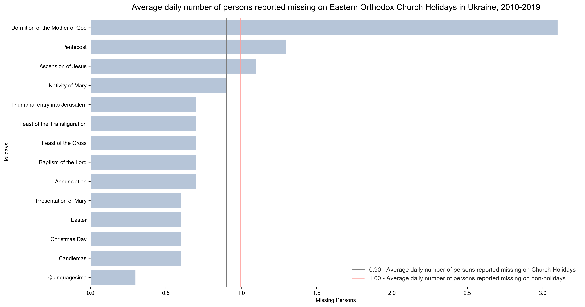

# Missing on holidays
Visualization project

This visualization project was concerned with answering the following question - Is an average daily number of persons reported missing on Eastern Orthodox Church Holidays different from an average daily number of persons reported missing on non-holidays in Ukraine?

